# SSTC 1
### This is a showcase of the solid state tesla coil project I've built. **(WIP)**

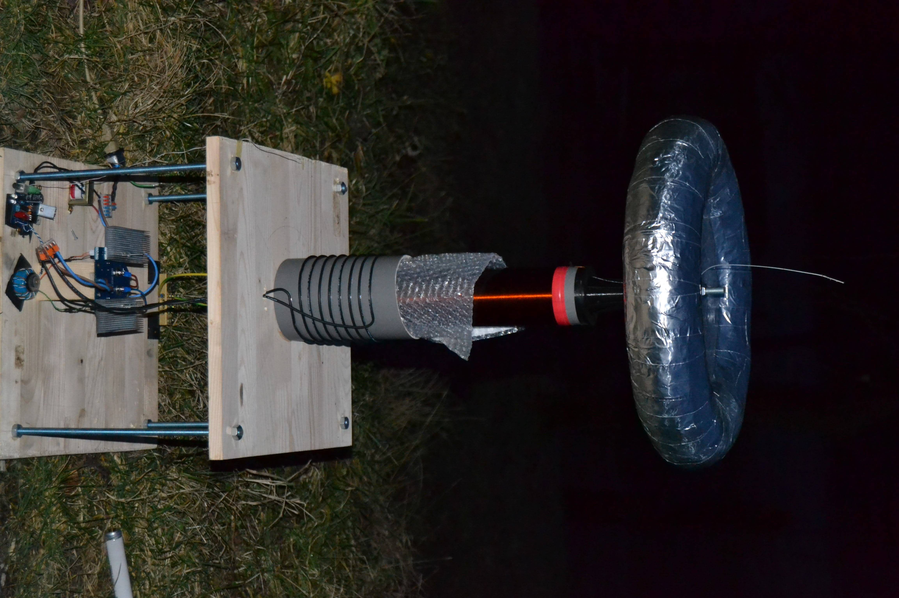

___

### Table of contents

* [Story](#story)
* [Start of the project](#start)
* [Construction](#construction)
  * [Logic board](https://github.com/BojanDolic/SSTC1/blob/main/README.md#logic-board)
  * [Driver board](https://github.com/BojanDolic/SSTC1/blob/main/README.md#driver-board)
  * [Secondary and topload](https://github.com/BojanDolic/SSTC1/blob/main/README.md#secondary-coil-and-topload)
    * [Secondary winding/topload holder](https://github.com/BojanDolic/SSTC1/blob/main/README.md#secondary-coil-and-topload-holder) 

____

# Story

Ever since I visited the Nikola Tesla Museum in Belgrade in high school, and saw the tesla coil in person, I wanted to build my own version for myself. After all, it is pretty hard to make one and it is also a dangerous device.

I've always tinkered with electronics but never had a chance to build one until now. Although this one and the one in Belgrade differ quite a bit (besides the size :smile:), the principle of the operation is the same.

Unlike the one in the museum, this one uses semiconductors instead of the spark gap.

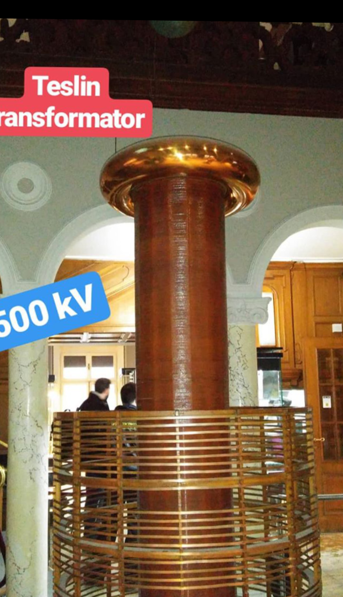

#### (Tesla coil photographed in the Belgrade during my visit)

___

# Start

I started researching what would be the most cost-effective way to build the tesla coil and a decision was made for it to be an SSTC.
### SSTC uses semiconductors instead of the spark gap to switch the primary coil. The most significant difference is the absence of resonant capacitors (primary capacitors). Because of this, the SSTC cannot generate huge voltages at the output; however, it is much cheaper to build.

My plan was to look at the builds other coilers made and try something similar. I went for the proven design of the Steve Ward with a few modifications regarding the logic board.

After that, I started to do calculations using an awesome tool called [JavaTC](http://www.classictesla.com/java/javatc/javatc.html).

My plan was to build a platform that houses all the electronics and above the platform would sit the secondary coil.
The secondary coil resonant frequency I was aiming for was ***300kHz max*** (preferably below that).

___
# Construction

The first thing I did was visualized everything in my head, how I should place the components and ECBs.

The second thing was to design the PCBs and have them manufactured. [JLCPCB](https://jlcpcb.com/) was chosen for board manufacturing.

## Logic board

I started with the logic board PCB and that was the first ever PCB I designed and manufactured.
The logic board uses the UCC27425 driver to drive the FETs. 
The feedback signal is picked up by the antenna and together with the optical receiver, it triggers the driver which drives the FETs through the [gate drive transformer](https://github.com/BojanDolic/SSTC1/blob/main/README.md#gate-drive-transformer).

### Images of the logic board

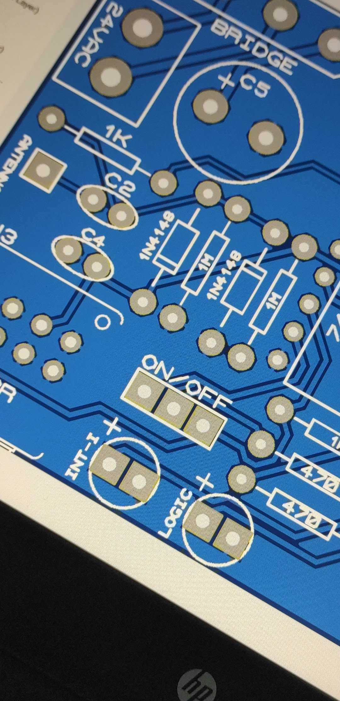

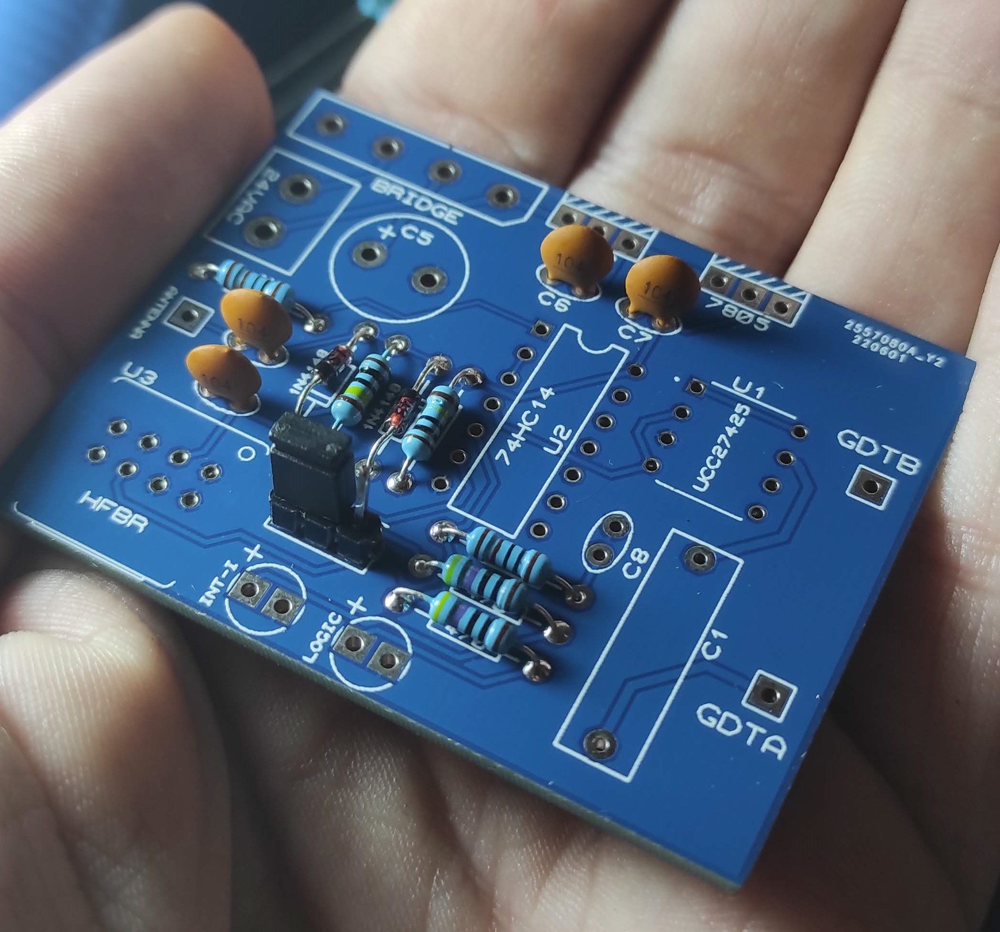

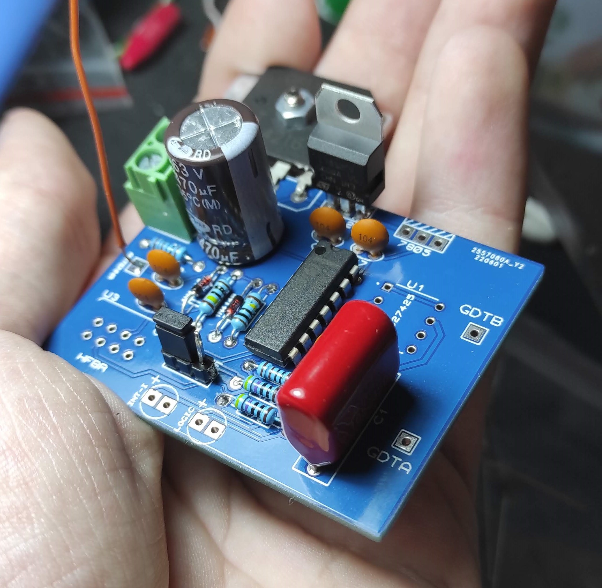

### Gate drive transformer

I used the gate driver transformer to provide galvanic isolation between the logic and switching boards. The output of the GDT is around 18V.
GDT is constructed using a ferrite toroid made of N30 material and a Cat5 cable. I twisted the wires together to lower the parasitic inductance which needs to be kept at a minimum at high switching frequencies.

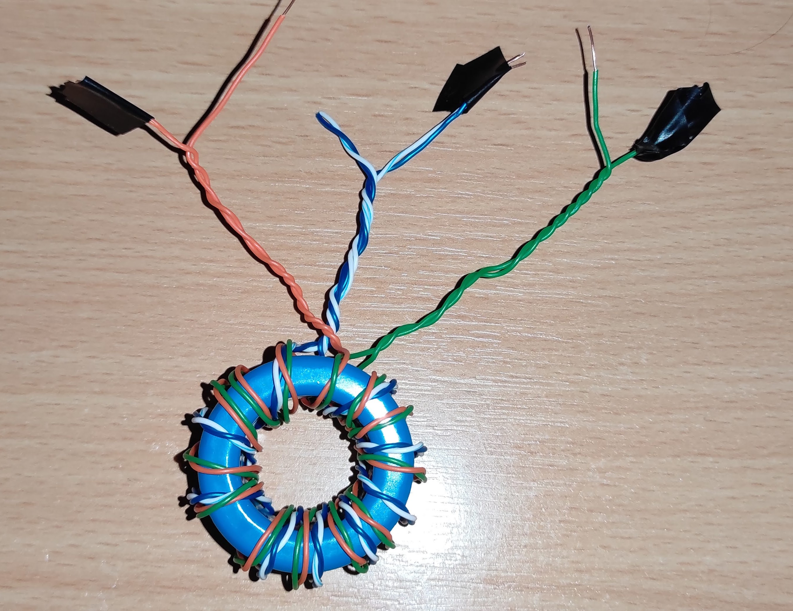

## Driver board

The second board I designed was the driver/switching board. It consists of the gate circuitry and two FETs in a half-bridge configuration. I decided on the half-bridge because it is cheaper (it uses only two transistors) but it has lower performance.
The bus capacitor is a large electrolytic capacitor with screw terminals (1000µF/400V) which is directly fed with full-wave rectified 230VAC (Red and blue wires).

### Images of the driver board

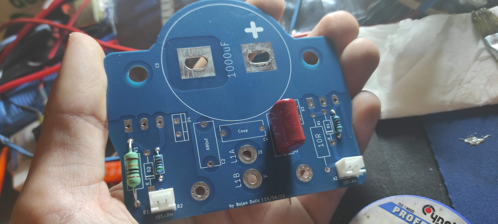
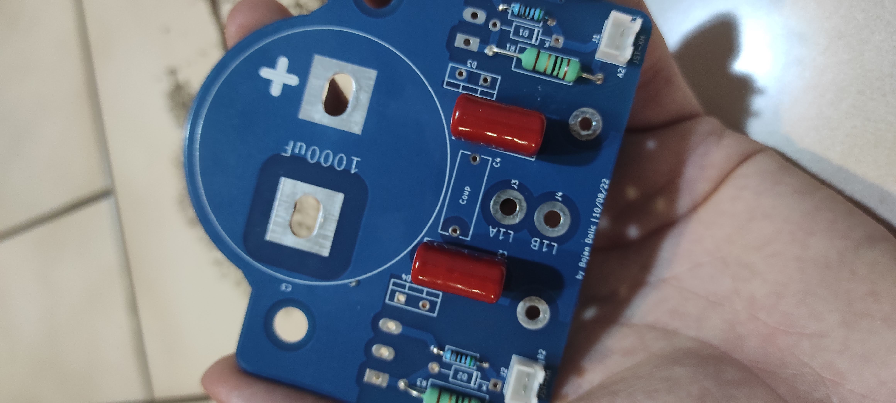
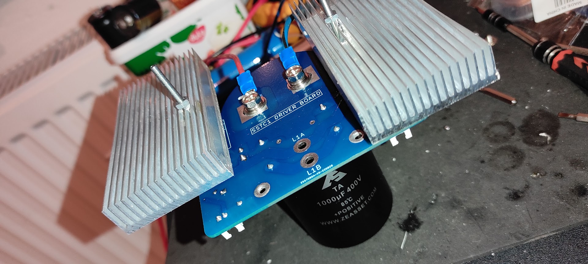

## Secondary coil and topload

One of the most painstaking things when building the tesla coil is the secondary winding. The problem with the secondary winding is that it needs to be made with hundreds of windings of very thin copper wire, in my case that is around 1030 turns of 28 AWG wire.

### Secondary coil and topload holder

I made a little contraption to ease the winding process. It consists of a simple holder which holds the motor of the cordless drill and it is controlled by the PWM controller. I made my secondary in about 3 to 4 hours with this device.

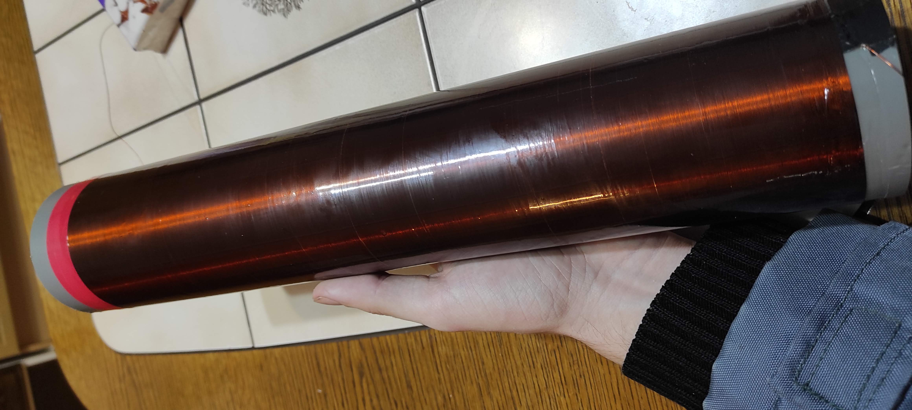

After the secondary was wound, I applied two coats of polyurethane varnish to the secondary windings to prevent corona formation and make the secondary sturdier.
To install topload on top of the secondary I designed two parts in fusion 360 which were later 3D printed.

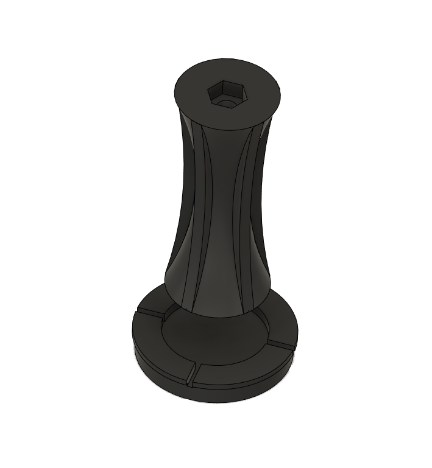

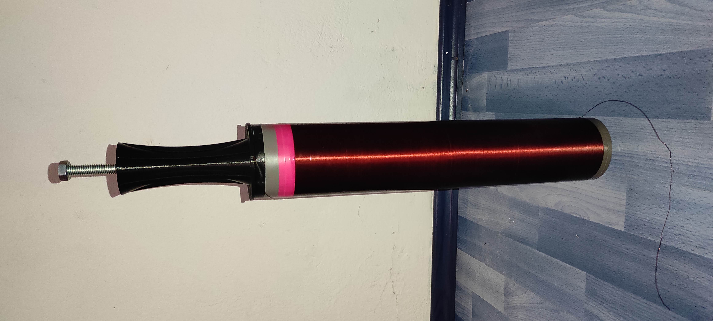

### Topload construction

I chose toroid for the shape of the topload. On most coils today, toroid is the dominant shape for the topload instead of the sphere.
To achieve desired resonant frequency of the secondary I needed to build the topload with specific dimensions.

Topload was built using 

